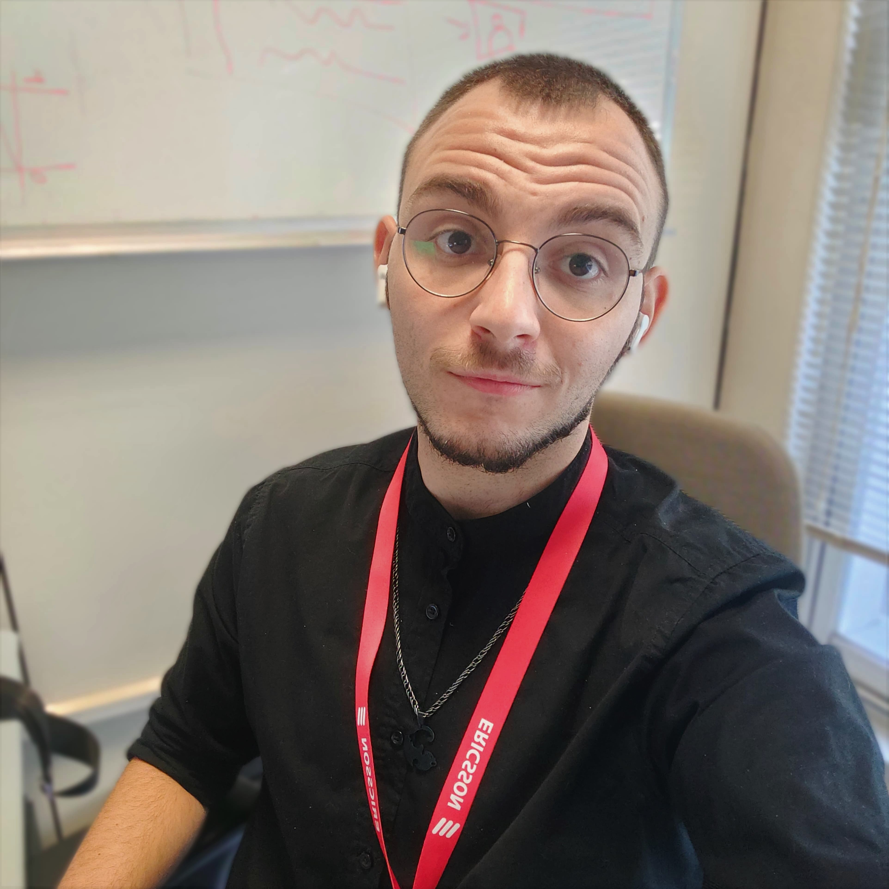
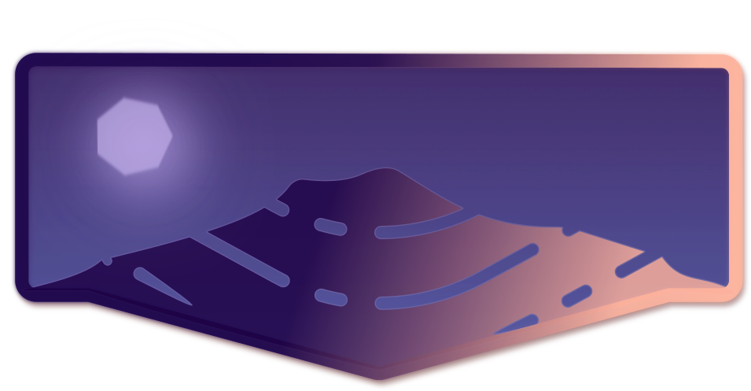

    <h2>📃 Raffele Castellano's Portfolio </h2>

 
    <h2>💬 About me</h2>
    

        
        <vl style="border-left: 2px solid #fafafaaa;">
        
 
            I'm a Software Engineer graduate with experience in Machine Learning and Data Science. 
            On top of that I have a strong passion for technology and innovation. I love to learn new things and I'm always looking for new challenges. I'm a team player and I like to share my knowledge with others. I'm also a very creative person and I like to express my creativity through design and art.
        

    

    <h2>🛠 Skills</h2>
    A snapshot of my skills:
    

        <h3 style="width: 15vw;"> Machine learning and Data Science </h3>
        <vl style="border-left: 2px solid #fafafaaa;">
        
 
            I am well-versed in machine learning concepts and techniques, including data preprocessing, feature engineering, model training and evaluation, and model deployment. I have experience with advanced techniques for example knowledge distillation processes and have contributed to projects that involve real-world data analysis.
        

    

    

        <h3 style="width: 15vw;;"> Programming Languages </h3>
        <vl style="border-left: 2px solid #fafafaaa;">
        
 
            I have a comprehensive understanding of various programming languages, such as Python, Java, C, C++, C#, JavaScript, HTML, CSS, SQL, PHP, Bash, and GOLang. This proficiency enables me to approach diverse projects with the right tools and technologies. I am also familiar with the Linux environment and the Git version control system.
        

    

    

        <h3 style="width: 15vw;;"> Software Development And Problem Solving </h3>
        <vl style="border-left: 2px solid #fafafaaa;">
        
 
            With a background in software engineering and the intership with Ericsson, I am skilled in full-stack web development and the management of the software lifecycle. I excel at problem-solving and thrive in collaborative environments where innovative solutions are key. 
        

    

    

        <h3 style="width: 15vw;;"> Design and Creativity </h3>
        <vl style="border-left: 2px solid #fafafaaa;">
        
 
            I have a strong passion for design and creativity. I have experience with Inkscape, Shapr3D, and I am familiar with the Adobe suite. I have also worked on several projects that required me to design and create logos, posters, and other visual elements. I am also a very creative person and I like to express my creativity through design and art. 
        

    

    

        <h3 style="width: 15vw;;"> Languages </h3>
        <vl style="border-left: 2px solid #fafafaaa;">
        
 
           I am a native Italian speaker and I am all-around fluent in English.
        

    

    <h2>💻 Work Experience</h2>
    <h3>IT Researcher at <a href="https://www.coritel.it/">CoRiTeL</a>  </h3>
    
 Novemver 2022 - Present 

    

        ' Coritel is a research consortium on telecommunications, founded in 1994 and is currently composed of two industrial partners - <a href="https://www.ericsson.com/it/about-us/company-facts/ericsson-worldwide/italy">Ericsson Telecomunicazioni</a> and <a href="https://www.innovaway.it/">Innovaway</a> - and two universities - <a href="https://www.unisa.it/">University of Salerno</a> and <a href="https://www.polimi.it/">Politecnico di Milano</a>. '
    

    
 
        In this role, I've contributed to diverse projects spanning Machine Learning / Artificial Intelligence, E-Health, and Cybersecurity. My responsibilities include researching the forefront of relevant fields to inform our projects, developing, rigorously testing, and iterating novel machine learning and AI algorithms, crafting interactive web applications to visualize and demonstrate project outcomes, collaborating seamlessly across teams to achieve collective project goals, authoring scientific papers to disseminate findings and advancements, and engaging in a comprehensive study of current cybersecurity standards and next-gen quantum security. All of that while creating summaries and reports for the sake of management and record-keeping.
    

    <h3>Intership at <a href="https://www.ericsson.com/it/about-us/company-facts/ericsson-worldwide/italy">Ericsson</a> </h3>
    
 July 2022 - October 2022 

    

        ' Ericsson is a world leader in the rapidly changing environment of communications technology – by providing hardware, software, and services to enable the full value of connectivity. '
    

    
 
        During my internship at Ericsson, I played a pivotal role in developing an application using GoLang and creating a Docker image. This initiative aimed to ensure efficient management of the lifecycle of containerized applications within a Kubernetes environment. Through this experience, I acquired expertise in implementing best practices for developing containerized applications. Throughout the internship, I encountered stimulating challenges, familiarized myself with company procedures, and gained a profound understanding of the dynamics of the telecommunications industry.
    

    <h2>♟ Individual Projects</h2>
    <h3>vesuveus</h3>
    
 
        a 3D printed keyboard, with a focus on compactness, ergonomics, and functionality. For more information, visit the <a href="https://github.com/RaffOwO/vesuveus">vesuveus</a> repository.
        

        

            
        

        

            
        

        

    

    <h2>📚 Education</h2>
    <h3>University of Salerno - Software Engineering</h3>
    
 September 2019 - October 2022 

    <h3>ITI Renato Elia - Computer Science</h3>
    
 September 2014 - July 2019 

    <h2>📧 Contacts</h2>
    

            

                <h3> <a href="mailto:raffaelecastellano213@gmail.com">Email</a> </h3>
                
 raffaelecastellano213@gmail.com 

            

            

            <h3> <a href="https://www.linkedin.com/in/raffaele-castellano-71440a26b/">Linkedin</a> </h3>
            

            

                    <h3> Phone number </h3>
                    
 +39 327 535 1067 

            

    

